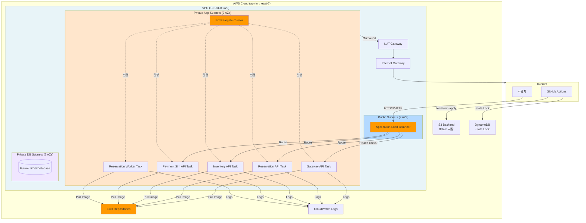
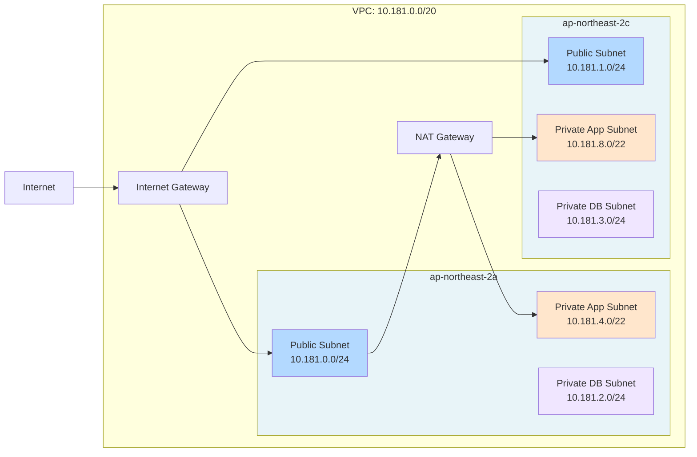
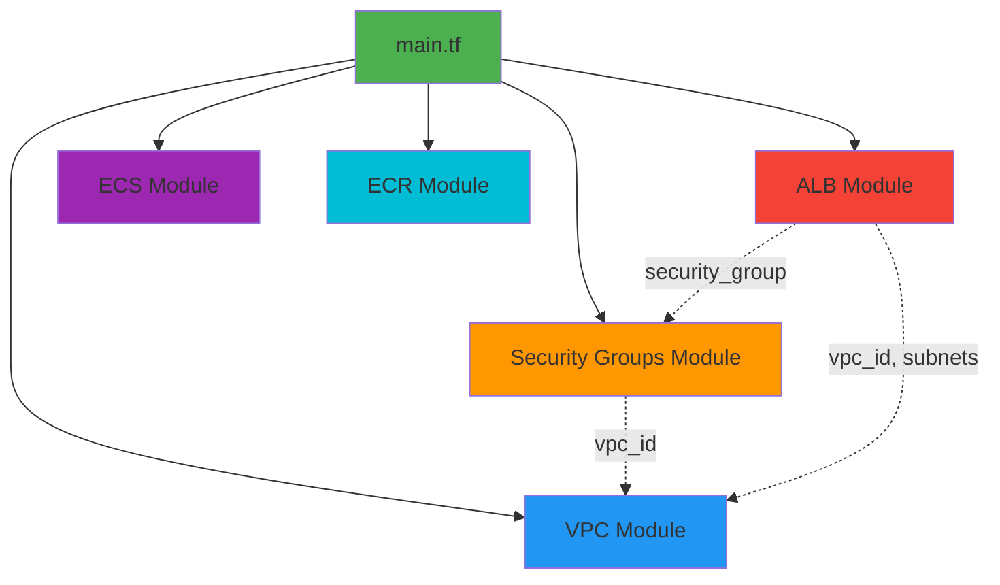
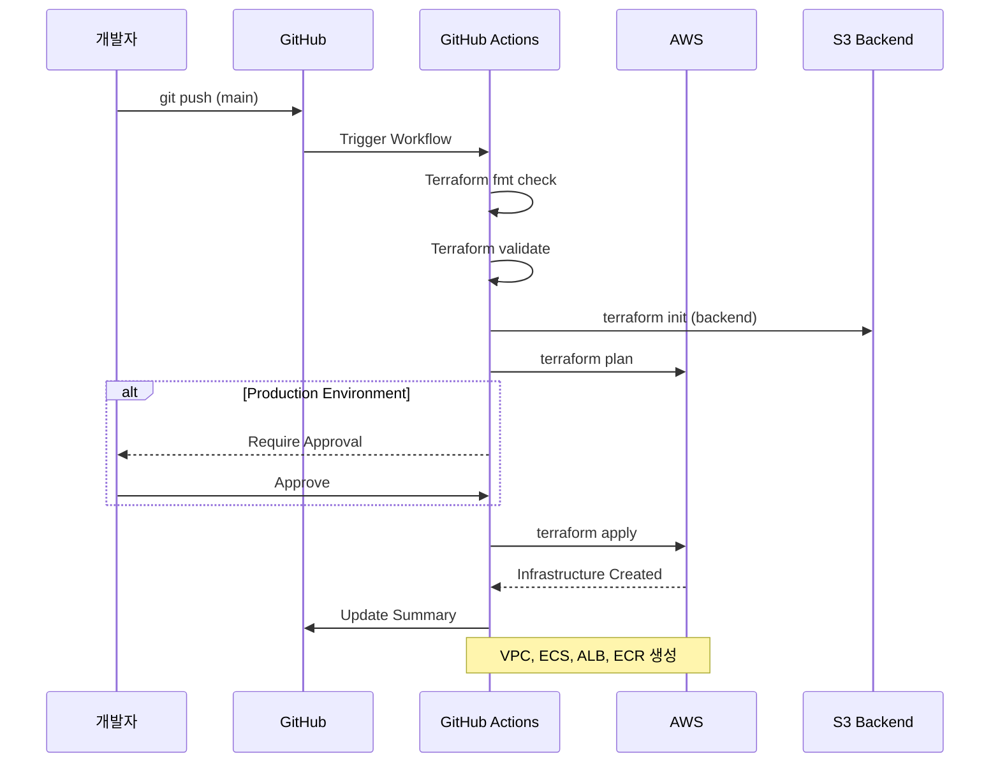
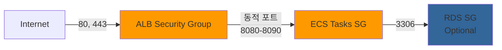

# Infrastructure Architecture

Terraform으로 구성된 Cat Demo AWS 인프라 아키텍처입니다.

## 전체 인프라 구조

## 네트워크 구조

## Terraform 모듈 의존성

## 배포 워크플로우

## 보안 그룹 규칙

## 주요 컴포넌트

### 1. VPC (Virtual Private Cloud)
- **CIDR**: 10.181.0.0/20
- **AZ**: ap-northeast-2a, ap-northeast-2c (2개)
- **Public Subnets**: ALB 배치
- **Private App Subnets**: ECS Tasks 배치
- **Private DB Subnets**: RDS 배치

### 2. ECS (Elastic Container Service)
- **Cluster**: cat-demo-cluster
- **Launch Type**: Fargate
- **Container Insights**: 비활성화
- **Services**:
  - Backend API
  - Frontend

### 3. ECR (Elastic Container Registry)
- Backend 및 Frontend 독립 리포지토리
- Lifecycle Policy: 10개 이미지 보관

### 4. ALB (Application Load Balancer)
- HTTP/HTTPS 리스너
- Health Check: `/health`
- ACM 인증서 지원 (*.go-to-learn.net)

### 5. Security Groups
- ALB SG: 80, 443 포트 오픈
- ECS Tasks SG: ALB에서의 트래픽만 허용
- RDS SG (Optional): ECS Tasks에서만 접근

### 6. IAM Roles
- **Task Execution Role**: ECR 이미지 pull, CloudWatch 로그
- **Task Role**: 애플리케이션별 AWS 서비스 접근

## 비용 예상 (1주일 기준)

| 리소스 | 사양 | 예상 비용 (1주일) |
|--------|------|----------|
| NAT Gateway | 1개 | $9.91 |
| ALB | 1개 | $5-7 |
| RDS | db.t3.micro | $4.03 |
| Bastion | t3.micro | $1.95 |
| EBS 스토리지 | 28GB | $0.66 |
| 기타 (Logs, 전송) | - | $2-4 |
| **합계** | - | **~$23-27/주** |

*CloudFront/WAF 비활성화로 비용 절감*
*실제 ECS Task 실행 시 vCPU, 메모리 사용량에 따라 추가 비용 발생*

## 참고사항

- CloudFront/WAF 모듈은 준비되어 있으나 현재 비활성화 상태
- RDS MySQL 8.0.39 실행 중 (db.t3.micro)
- Bastion Host를 통해 Private 리소스 접근 가능
- GitHub Actions를 통한 자동 배포 구성 완료
- Pre-commit hooks로 코드 품질 관리
- CI/CD 인프라(10.180.0.0/20)와 완전 분리된 Demo 인프라(10.181.0.0/20)
